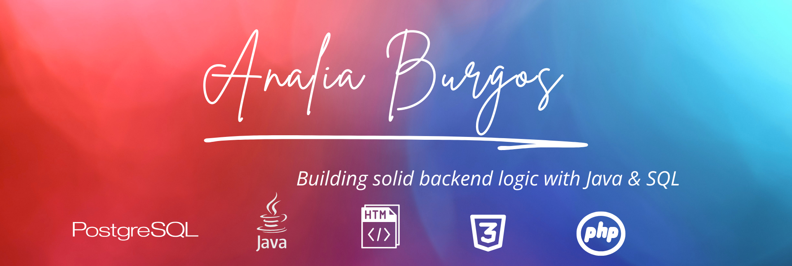

<!-- Banner o imagen personalizada (opcional) -->
<!-- Puedes crear una imagen en Canva y subirla al repo para colocar aquí -->

  

<h1 align="center" style="color:#2b1f51;">✨ ¡Hola! soy Analía Burgos! ✨</h1>

👋 Un poco sobre mí

Recientemente me gradué de la carrera  TUDAI (Tecnicatura Universitaria en Desarrollo de Aplicaciones Informáticas) en la Universidad Nacional del Centro de la Provincia de Buenos Aires (UNICEN).
Mi formación académica y experiencia en proyectos me dieron una base sólida en el desarrollo backend, con foco en Java y bases de datos relacionales (SQL).

Disfruto diseñar sistemas limpios, escalables y escribir código bien estructurado que resuelva problemas reales.
Actualmente estoy construyendo mi portafolio y en búsqueda de oportunidades para crecer como desarrolladora backend, especialmente en entornos basados en Java.

¡Te invito a explorar mis proyectos! 🚀
 

---

🛠️ Stack Tecnológico

**Lenguajes:**  

.  

.   

. 

**Herramientas & Frameworks:** 

.  

.   

.   

. 

**Control de versiones:**  

.  

. 

<!--## 🚀 Tecnologías que manejo

   
  
  
   
  
   
   

-->
---

---
# 💼 Experiencia Destacada
## 📊 Pasantía - Portal de Empleo del Municipio de Lobería

Durante mi pasantía profesional participé en el desarrollo del Portal de Empleo del Municipio de Lobería, trabajando en la documentación, testing, diseño de base de datos y funcionalidades clave del sistema.

🔗 Visita el portal en : 
https://empleo.loberia.gob.ar

🔗 https://github.com/analiaBurgosDev/pasantiaMunicipio
 
---

## 🚲 Microservicios - App de Alquiler de Monopatines Eléctricos

Proyecto universitario desarrollado con Java Spring Boot, que implementa una arquitectura de microservicios para una plataforma de alquiler de monopatines eléctricos.

🔧 Tecnologías:
Java 17 · Spring Boot · Spring Data JPA · PostgreSQL · Eureka Server · Spring Cloud Gateway · Lombok

🧩 Arquitectura:

-🚲 Servicio de Monopatines

-👤 Servicio de Usuarios

-📍 Servicio de Ubicación

-🧾 Servicio de Alquiler

-💳 Servicio de Pagos

-📊 Servicio de Estadísticas

** 📌 Características principales: **

- CRUD para usuarios y monopatines

- Lógica de alquiler y simulación de pagos

- APIs REST para cada servicio

- Preparado para contenedores (Docker-ready)

- Datos SQL de ejemplo para pruebas rápidas

🔗 Ver Repositorio🔗 (https://github.com/analiaBurgosDev/Microservices_monopatines)

---

## 🎬 SQL – Consultas de Videoclub

Base de datos en PostgreSQL que simula un videoclub, con más de 20 consultas SQL reales y orientadas a negocio.

📁 Incluye:

- create_tables.sql

- insert_data.sql (datos de ejemplo estructurados)

- queries.sql (consultas comentadas)

- views.sql (vistas optimizadas para reportes)

** 📌 Aprendizaje: **

- Consultas avanzadas con joins, agregaciones y condiciones

- Vistas para reportes de películas más alquiladas, clientes destacados y facturación por distribuidor

- Esquema relacional limpio y normalizado

🔗 Ver Repositorio🔗 (https://github.com/analiaBurgosDev/sql_videoclub_queries)

---

## 👗 API REST de Inventario de Ropa

API RESTful en PHP con arquitectura MVC para la gestión de un inventario de prendas.

** 📌 Características: **

- CRUD de prendas

- Separación en Controladores, Modelos y Vistas

- Base de datos MySQL integrada

- Respuestas REST estructuradas

📌 aprendizaje:

- Ejemplo de backend más allá de Java

- Extensible con autenticación o integración frontend

🔗 Ver Repositorio🔗 (https://github.com/analiaBurgosDev/api_rest)

---

## 📫 Contacto

- 💼 LinkedIn: [www.linkedin.com/in/analiaburgos](www.linkedin.com/in/analiaburgos)
- 📧 Email: [analiaveronicadra@gmail.com](mailto:analiaveronicadra@gmail.com)

---

Gracias por ver mi perfil! 🙌  

